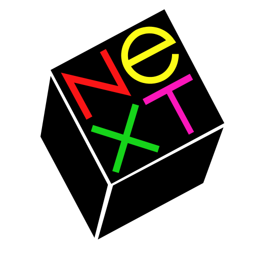
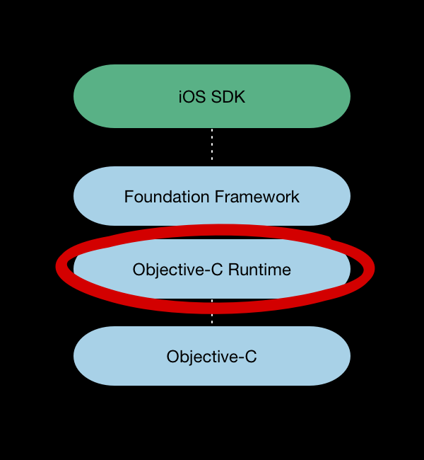

!SLIDE center

# Objective-C funtime

Boris Bügling - **@NeoNacho**

[http://buegling.com](http://buegling.com)

!SLIDE bullets incremental transition=curtainY

# Agenda

- Grundlagen der Objective-C runtime
- Was können wir damit machen?
- Zwei Beispiele für fortgeschrittene Nutzung

!SLIDE smaller center incremental transition=fade

# Eine kurze Geschichte von Objective-C

- **1983:** Designt von Brad Cox und Tom Love bei Stepstone

- **1989:** NeXTSTEP 1.0
- **2001:** Mac OS X 10.0
- **2007:** Objective-C 2.0 führt die Modern Runtime ein

!SLIDE fullscreen transition=fade

!SLIDE bullets incremental transition=fade

* C
* Public API

!SLIDE center code transition=fade

# objc/runtime.h

!SLIDE code transition=fade

# Objekte

    @@@ c
    typedef struct objc_object {
    	Class isa;
    } *id;

!SLIDE code smaller transition=fade

# Klassen

    @@@ c
    struct objc_class {
    	Class isa;
    
    #if !__OBJC2__
        Class super_class                                        OBJC2_UNAVAILABLE;
        const char *name                                         OBJC2_UNAVAILABLE;
        long version                                             OBJC2_UNAVAILABLE;
        long info                                                OBJC2_UNAVAILABLE;
        long instance_size                                       OBJC2_UNAVAILABLE;
        struct objc_ivar_list *ivars                             OBJC2_UNAVAILABLE;
        struct objc_method_list **methodLists                    OBJC2_UNAVAILABLE;
        struct objc_cache *cache                                 OBJC2_UNAVAILABLE;
        struct objc_protocol_list *protocols                     OBJC2_UNAVAILABLE;
    #endif
	} OBJC2_UNAVAILABLE;

!SLIDE code small transition=fade

# Messages

## Dies

    @@@ c
    [self doWithThing:thing];

## übersetzt der Compiler zu

    @@@ c
    objc_msgSend(self, @selector(doWithThing:), thing);

!SLIDE code small transition=fade

# Methoden

    @@@ c
    struct objc_method {
        SEL method_name                                          OBJC2_UNAVAILABLE;
        char *method_types                                       OBJC2_UNAVAILABLE;
        IMP method_imp                                           OBJC2_UNAVAILABLE;
    } OBJC2_UNAVAILABLE;

!SLIDE code small transition=fade

# Methoden Implementierung

    @@@ c
	typedef struct objc_selector     *SEL;

    typedef id (*IMP)(id self, SEL _cmd ,...);

!SLIDE code smaller transition=fade

# Message forwarding

    @@@ c
    +(BOOL)resolveInstanceMethod:(SEL)aSEL;

    -(void)forwardInvocation:(NSInvocation*)anInvocation;

    -(NSMethodSignature*)methodSignatureForSelector:(SEL)selector;

    -(BOOL)respondsToSelector:(SEL)aSelector;
